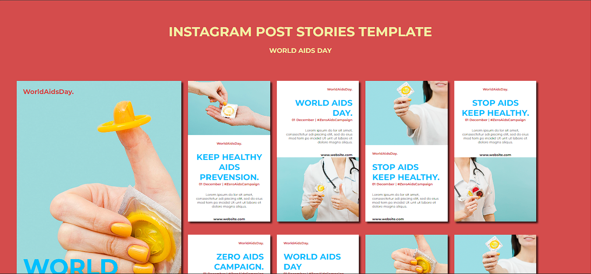
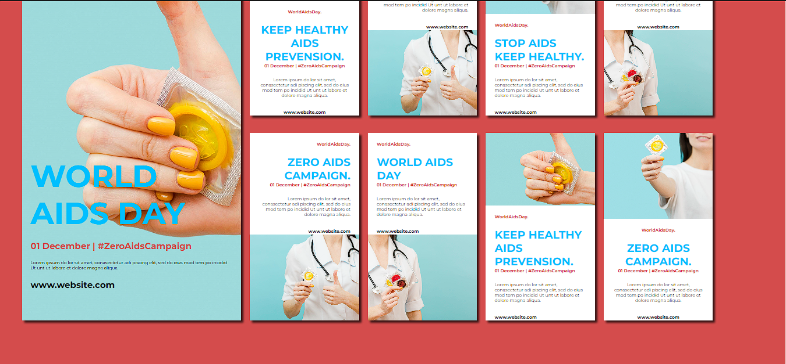

# World-Aids-Day
The site was made on react.

### To run you need yarn, if you don't have it, you'll have to install it.

Yarn installation:
- Enter in terminal: ``` npm install --global yarn. ```

- Check if it is installed using the command: ``` yarn --version ```

- Install all dependencies by typing: ``` yarn ``` in the terminal.

## Screenshots
## ---------------------------------------------------------------------

## ---------------------------------------------------------------------

